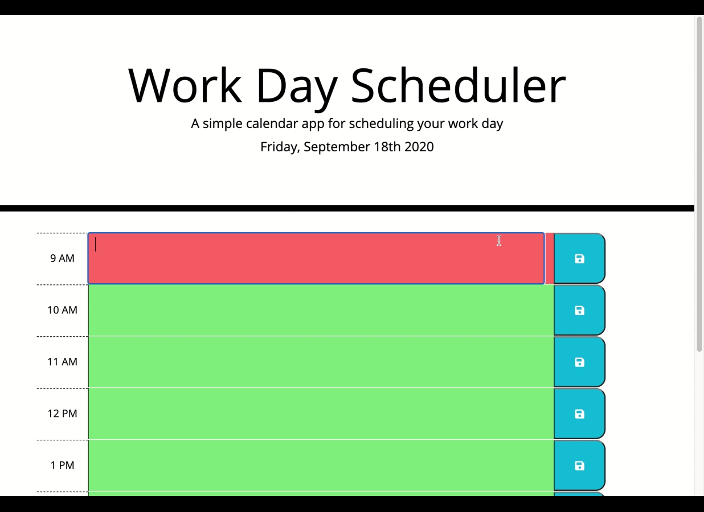

# Work-Day-Scheduler
A simple calendar application that allows the user to save events for each hour of the day.

https://katiec2116.github.io/Work-Day-Scheduler/

## Overview

This is a simple daily planner application that runs in the browser and features dynamically updated HTML and CSS powered by JavaScript, jQuery, and moment code. It features a clean and polished user interface and will store saved items in local storage.

   

## Features

## License

MIT

## Tests

No tests available

## Questions?

You can reach me at katiecampbel21@outlook.com

---

